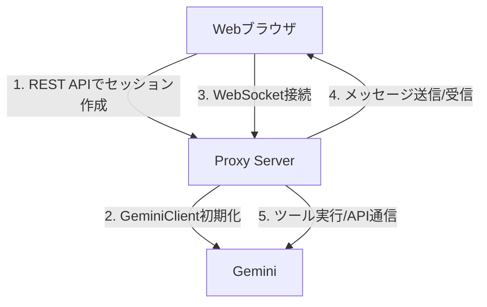

# Gemini CLI Proxy

Gemini CLI Proxyは、`@google/gemini-cli-core`を活用し、Gemini CLIをWebインターフェースからステートフルなエージェントとして利用するためのWebSocketプロキシです。

SlackやDiscodeなどのチャット、IDE、CI/CDパイプラインなど、様々な環境との柔軟な統合を目的としています。

## 概要

このプロキシは、Gemini CLIの対話モード（TUI版）のアーキテクチャを参考に、WebSocketを通じてリアルタイムな双方向通信を実現します。これにより、ステートレスな単発のコマンド実行ではなく、文脈を保持した継続的な対話が可能になります。

### 主な機能

- **リアルタイム対話**: WebSocketを通じたストリーミング応答
- **ステートフルなセッション管理**: 複数のセッションで独立した会話履歴を保持
- **ツール実行**: ファイルシステム、シェルコマンド、Web検索など、Gemini CLIの標準ツールを実行可能
- **スラッシュコマンド**: `/help`, `/clear`など、TUI版の便利なコマンドをWeb経由で利用可能
- **Docker対応**: Docker Composeによる簡単な環境構築

## アーキテクチャ

主要なコンポーネントは、WebSocketサーバー、セッション管理、そして動作確認用のExpress Webサーバーで構成されています。

### データフロー



## セットアップ方法

DockerとDocker Composeを使用して、簡単に環境を構築できます。

### 前提条件

- Docker と Docker Compose
- Gemini API キー

### 手順

1.  **環境変数の設定**

    プロジェクトのルートに`.env`ファイルを作成し、お使いのGemini APIキーを設定します。

    ```.env
    GEMINI_API_KEY=your-api-key-here
    ```

2.  **コンテナのビルドと起動**

    ```bash
    docker-compose up -d --build
    ```

3.  **アクセス**

    サーバーは `http://localhost:3000` で起動します。
    ブラウザでアクセスすると、動作確認用のテスト画面が表示されます。

### 開発者向けコマンド

- **ログの確認**:
  ```bash
  docker-compose logs -f
  ```
- **コンテナの停止**:
  ```bash
  docker-compose down
  ```

## API仕様

### REST API

#### `POST /api/chat`
新しいチャットセッションを作成します。

**レスポンス:**
```json
{
  "sessionId": "一意のセッションID"
}
```

### WebSocket API

セッション作成後、WebSocketで接続します。

1.  **接続初期化**
    取得した`sessionId`を送信します。
    ```json
    {
      "type": "init",
      "sessionId": "一意のセッションID"
    }
    ```

2.  **メッセージ送信**
    ```json
    {
      "type": "message",
      "content": "ユーザーからのメッセージ"
    }
    ```

3.  **レスポンス形式**
    AIからの応答は、`stream_chunk`イベントとしてストリーミングされます。
    ```json
    {
      "type": "stream_chunk",
      "data": {
        "type": "content", // または tool_code, tool_result など
        "data": "AIの応答テキスト"
      }
    }
    ```

## 技術スタック

- **バックエンド**: Node.js, Express
- **リアルタイム通信**: WebSocket (`ws`)
- **コアロジック**: `@google/gemini-cli-core`
- **言語**: TypeScript
- **コンテナ**: Docker

## 制限事項

- **セッションの永続化**: 現在はインメモリでセッションを管理しているため、サーバーを再起動すると履歴は失われます。
- **スケーラビリティ**: 単一プロセスで動作するため、大規模な利用には対応していません。

## 未実装の機能

- **MCP統合**: `mcp-client`を通じた動的ツールの読み込み機能は現在未実装です。

## ライセンス

[MIT License](LICENSE)
