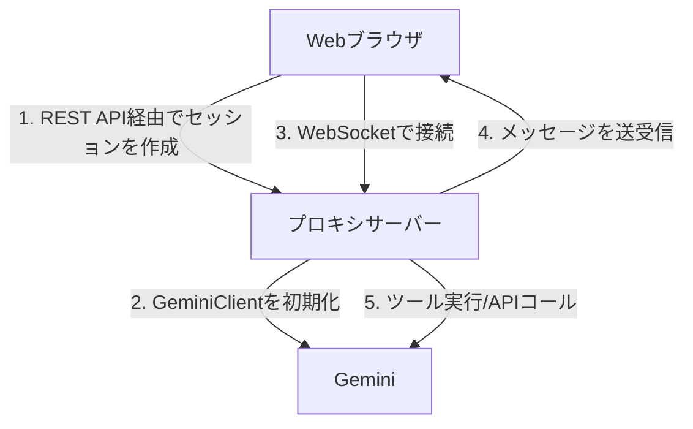

# Gemini CLI Proxy

[](https://www.apache.org/licenses/LICENSE-2.0)

`@google/gemini-cli-core` を利用し、Webインターフェース経由でのステートフル（状態保持型）かつエージェント的な対話を可能にする、Gemini CLI向けのWebSocketベースのプロキシです。

このプロジェクトは、Slackのようなチャットツール、IDE、CI/CDパイプラインなど、様々な環境との柔軟な連携を提供することを目的としています。

## 概要

このプロキシは、Gemini CLIの対話型TUIモードのアーキテクチャを参考に、WebSocketを介したリアルタイムかつ双方向の通信の実装です。このアプローチにより、ステートレスで単発のコマンド実行を超え、継続的で文脈を意識した会話を実現します。

### 主な特徴

  - **リアルタイムな対話**: WebSocketを介したストリーミング応答による、滑らかなユーザー体験。
  - **ステートフルなセッション管理**: 複数のセッションに対して、独立した会話履歴を保持。
  - **ツール実行**: ファイルシステム操作、シェルコマンド、Web検索など、標準的なGemini CLIのツールをサポート。
  - **スラッシュコマンド**: Web向けに `/help` や `/clear` といった、TUIでおなじみのコマンドを実装。
  - **コンテナ対応**: Docker Composeによる簡単なセットアップ。

## アーキテクチャ

コアコンポーネントは、WebSocketサーバー、セッションマネージャー、そして初期セットアップとデモクライアントの提供を行うExpressウェブサーバーで構成されています。

### データフロー



## 利用開始ガイド

DockerとDocker Composeを使えば、このプロキシをすぐに起動して実行できます。

### 前提条件

  - DockerおよびDocker Compose
  - Gemini APIキー

### インストール

1.  **環境変数を設定する**

    プロジェクトのルートディレクトリに `.env` ファイルを作成し、あなたのGemini APIキーを追加します。

    ```.env
    GEMINI_API_KEY=your-api-key-here
    ```

2.  **コンテナをビルドして実行する**

    ```bash
    docker compose up -d --build
    ```

3.  **サービスにアクセスする**

    サーバーは `http://localhost:3000` で利用可能になります。このアドレスでは、簡単なテストクライアントが提供されます。

### 開発用コマンド

  - **ログを表示する**:
    ```bash
    docker compose logs -f
    ```
  - **コンテナ内をデバッグする**:
    ```bash
    docker exec -it gemini-cli-proxy-gemini-cli-proxy-1 bash
    ```

## GCEへのデプロイ

### 準備: Secret Managerにシークレットを登録

```powershell
# YOUR_GEMINI_KEY のようなプレースホルダーを実際の値に置き換えてください。
Write-Output -NoNewline "YOUR_GEMINI_KEY" | gcloud secrets create gemini-api-key `
    --data-file=- `
    --labels="service=gemini-cli-proxy"

Write-Output -NoNewline "YOUR_GITHUB_APP_ID" | gcloud secrets create github-app-id `
    --data-file=- `
    --labels="service=gemini-cli-proxy"

Write-Output -NoNewline "YOUR_GITHUB_APP_INSTALLATION_ID" | gcloud secrets create github-app-installation-id `
    --data-file=- `
    --labels="service=gemini-cli-proxy"

gcloud secrets create github-app-private-key `
    --data-file="path/to/your/private-key.pem" `
    --labels="service=gemini-cli-proxy"
```

### COSでデプロイ

```bash
# シークレットを取得

GEMINI_API_KEY="$(gcloud secrets versions access latest --secret='gemini-api-key')"
GITHUB_APP_ID="$(gcloud secrets versions access latest --secret='github-app-id')"
GITHUB_APP_INSTALLATION_ID="$(gcloud secrets versions access latest --secret='github-app-installation-id')"
GITHUB_APP_PRIVATE_KEY="$(gcloud secrets versions access latest --secret='github-app-private-key')"

# VMの基本的な設定
PROJECT_ID="YOUR_PROJECT_ID"
ZONE="us-central1-f"
INSTANCE_NAME="vm-endpoint01"
MACHINE_TYPE="e2-medium"

# インスタンスを作成
gcloud compute instances create-with-container "${INSTANCE_NAME}" \
    --project "${PROJECT_ID}" \
    --zone "${ZONE}" \
    --machine-type "${MACHINE_TYPE}" \
    --container-image "docker.io/koduki/gemini-cli-proxy" \
    --container-restart-policy "always" \
    --container-env "GEMINI_API_KEY=${GEMINI_API_KEY},GITHUB_APP_ID=${GITHUB_APP_ID},GITHUB_APP_INSTALLATION_ID=${GITHUB_APP_INSTALLATION_ID},GITHUB_APP_PRIVATE_KEY=${GITHUB_APP_PRIVATE_KEY}" \
    --container-mount-host-path "host-path=/home/chronos/workspace,mount-path=/workspace" \
    --boot-disk-size "10GB" \
    --image-project "cos-cloud" \
    --image-family "cos-stable" \
    --provisioning-model "SPOT" \
    --instance-termination-action "STOP" \
    --network-interface "network=default,subnet=default" \
    --scopes "https://www.googleapis.com/auth/devstorage.read_only,https://www.googleapis.com/auth/logging.write,https://www.googleapis.com/auth/monitoring.write,https://www.googleapis.com/auth/service.management.readonly,https://www.googleapis.com/auth/servicecontrol,https://www.googleapis.com/auth/trace.append" \
    --shielded-vtpm \
    --shielded-integrity-monitoring \
    --no-shielded-secure-boot \
    --metadata "enable-oslogin=true,google-logging-enabled=true,google-monitoring-enabled=true" \
    --labels "container-vm=${INSTANCE_NAME}" \
    --tags "session-node" 
```

## APIリファレンス

### REST API

#### `POST /api/chat`

新しいチャットセッションを初期化します。

**レスポンス:**

```json
{
  "sessionId": "unique-session-id"
}
```

### WebSocket API

セッションを作成した後、WebSocketエンドポイントに接続します。

1.  **接続を初期化する**

    接続をセッションと関連付けるために `sessionId` を送信します。

    ```json
    {
      "type": "init",
      "sessionId": "unique-session-id"
    }
    ```

2.  **メッセージを送信する**

    ```json
    {
      "type": "message",
      "content": "Your message here"
    }
    ```

3.  **レスポンスを受信する**

    AIからの応答は `stream_chunk` イベントとしてストリーミングされます。

    ```json
    {
      "type": "stream_chunk",
      "data": {
        "type": "content", // または "tool_code", "tool_result", etc.
        "data": "AI response text"
      }
    }
    ```

## 技術スタック

  - **バックエンド**: Node.js, Express
  - **リアルタイム通信**: WebSocket (`ws`)
  - **コアロジック**: `@google/gemini-cli-core`
  - **言語**: TypeScript
  - **コンテナ化**: Docker

## 制限事項

  - **セッションの永続化**: 現在、セッションはメモリ内に保存されており、サーバーが再起動すると失われます。
  - **スケーラビリティ**: このプロキシはシングルプロセスで動作し、追加の変更なしでは大規模なデプロイメント向けには設計されていません。

## ライセンス

このプロジェクトは [Apache License 2.0](https://www.google.com/search?q=LICENSE) の下でライセンスされています。