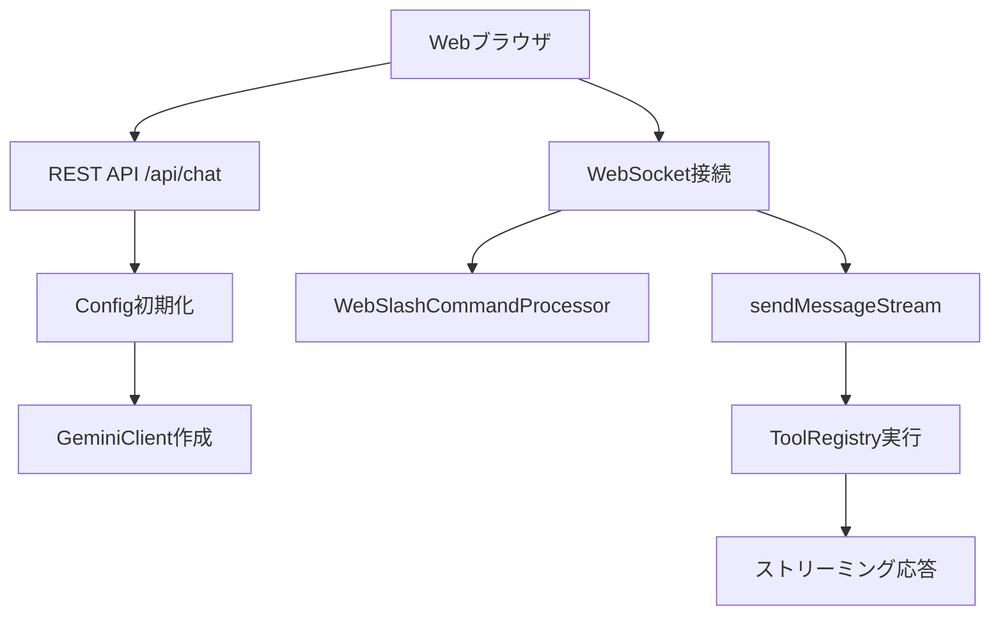

# Gemini CLI Proxy

Gemini CLI Proxyは、Gemini CLIをWebインターフェースから利用するためのProxyです。`@google/gemini-cli-core`パッケージを活用し、対話モード(TUI版)のコードを参考にWebSocketで対話できるようにすることで、ステートレスな非対話モードではなく、ステートフルなエージェントとして、チャットやIDE、CI/CDパイプラインとの統合をサポートします。

## 概要

Gemini CLIのアーキテクチャを踏襲し、以下の主要機能を提供します：

- **リアルタイム対話**: WebSocketを通じたストリーミング応答
- **ツール実行**: 組み込みツール（ファイルシステム、シェルコマンド、Web取得など）の実行
- **スラッシュコマンド**: TUI版コマンドをWeb版に移植
- **セッション管理**: 複数の同時セッションと会話履歴の保持

## アーキテクチャ

### コアコンポーネント

1. **WebSocketサーバー**: リアルタイム双方向通信
2. **セッション管理**: インメモリでの会話履歴とConfig管理
3. **スラッシュコマンドプロセッサー**: TUI版コマンドのWeb版実装
4. **Express Webサーバー**: 動作確認用のテスト画面

### データフロー



## 主要機能

### 1. セッション管理

各セッションごとに独立した`Config`インスタンスと履歴を管理：

```typescript
const sessions = new Map<string, {
  sessionId: string;
  history: Array<{
    role: 'user' | 'assistant';
    content: string;
    timestamp: Date;
  }>;
  config: Config;
  workingDir: string;
}>();
```

### 2. スラッシュコマンド

TUI版コマンドをWeb版に移植：

- `/help` - ヘルプ表示
- `/clear` - チャット履歴クリア（`geminiClient.resetChat()`を使用）
- `/tools` - 利用可能ツール一覧（`toolRegistry.getFunctionDeclarations()`を使用）
- `/chat save <tag>` - 履歴保存（簡易実装）

### 3. ツール実行

<cite>packages/core/src/tools/tools.ts:1-100</cite>の`Tool`インターフェースに基づくツール実行：

- **ファイルシステムツール**: `read_file`, `write_file`, `list_directory`
- **実行ツール**: `run_shell_command`
- **Webツール**: `web_fetch`, `google_web_search`
- **メモリツール**: `save_memory`

## API仕様

### REST API

#### POST /api/chat
新しいチャットセッションを作成し、`Config`インスタンスを初期化

**レスポンス:**
```json
{
  "sessionId": "uuid-string"
}
```

### WebSocket API

#### 接続初期化
```json
{
  "type": "init",
  "sessionId": "uuid-string"
}
```

#### メッセージ送信
```json
{
  "type": "message",
  "content": "ユーザーメッセージ"
}
```

#### レスポンス形式
```json
{
  "type": "stream_chunk",
  "data": {
    "type": "content",
    "data": "AIの応答テキスト"
  }
}
```

## セットアップ

### 前提条件

- Node.js 20以上
- Gemini API キー
- `@google/gemini-cli-core`パッケージ

### インストール

1. 依存関係のインストール：
```bash
npm install @google/gemini-cli-core @google/genai
```

2. 環境変数の設定：
```bash
export GEMINI_API_KEY="your-api-key-here"
```

3. サーバー起動：
```bash
npm run dev
```

## 技術仕様

### 依存関係

- `@google/gemini-cli-core`: <cite>packages/core/src/index.ts:1-95</cite>のコアライブラリ
  - `Config`: 設定管理
  - `GeminiClient`: API通信
  - `ToolRegistry`: ツール管理
  - `AuthType`: 認証タイプ
- `@google/genai`: Gemini API クライアント
- `express`: Webサーバーフレームワーク
- `ws`: WebSocketライブラリ


### @google/gemini-cli-core 統合

以下の`@google/gemini-cli-core`の主要コンポーネントを活用しています：

#### 1. Config クラス

<cite>packages/core/src/config/config.ts:188-218</cite>の`Config`クラスは、Gemini APIとの通信、ツール管理、認証を統合的に管理します：

```typescript
const config = new Config({
  sessionId: sessionId,
  targetDir: workingDir,
  debugMode: false,
  cwd: workingDir,
  model: 'gemini-2.5-pro',
  embeddingModel: 'gemini-embedding-001',
  fullContext: false,
  checkpointing: false,
  coreTools: undefined,
  excludeTools: [],
});
```

#### 2. GeminiClient クラス

<cite>packages/core/src/core/client.ts:87-150</cite>の`GeminiClient`は、Gemini APIとの通信を管理し、以下の機能を提供：

- **ストリーミング通信**: `sendMessageStream()`によるリアルタイム応答
- **チャット履歴管理**: 会話コンテキストの自動管理
- **トークン制限対応**: <cite>packages/core/src/core/client.ts:101-106</cite>の自動圧縮機能
- **認証管理**: <cite>packages/core/src/core/contentGenerator.ts:37-41</cite>の`AuthType.USE_GEMINI`による認証

#### 3. ツールシステム

<cite>packages/core/src/tools/tool-registry.ts:127-390</cite>の`ToolRegistry`クラスが提供するツール管理機能：

- **組み込みツール**: <cite>packages/core/src/index.ts:62-74</cite>で定義されている標準ツール群
  - `ReadFileTool`: ファイル読み取り
  - `WriteFileTool`: ファイル書き込み
  - `ShellTool`: シェルコマンド実行
  - `WebFetchTool`: Web取得
  - `MemoryTool`: メモリ管理
- **動的ツール発見**: <cite>docs/core/tools-api.md:23-26</cite>のMCPサーバー統合
- **ツール実行フロー**: <cite>docs/core/tools-api.md:51-64</cite>の標準実行パイプライン

#### 4. ストリーミング処理

<cite>packages/core/src/core/turn.ts:163-173</cite>の`Turn`クラスによるイベントベースの処理：

- **ServerGeminiStreamEvent**: <cite>packages/core/src/core/turn.ts:43-55</cite>のイベント型システム
- **関数呼び出し処理**: ツール実行要求の自動検出と実行
- **エラーハンドリング**: 統合されたエラー処理機能

### 認証システム

<cite>packages/core/src/core/contentGenerator.ts:37-41</cite>の認証システムを使用：

```typescript
await config.refreshAuth(AuthType.USE_GEMINI);
```

- **API キー認証**: `GEMINI_API_KEY`環境変数による認証
- **自動トークン管理**: セッション間でのトークン状態管理
- **エラー処理**: 認証失敗時の適切なエラーハンドリング

### ツール実行

<cite>packages/core/src/core/nonInteractiveToolExecutor.ts:21-26</cite>の`executeToolCall`関数を活用したツール実行：

```typescript
const toolResponse = await executeToolCall(
  session.config,
  requestInfo,
  toolRegistry,
  new AbortController().signal
);
```

この関数は以下の機能を提供：
- **ツール検証**: パラメータ検証と存在確認
- **実行管理**: AbortSignalによるキャンセル対応
- **結果変換**: <cite>packages/core/src/core/coreToolScheduler.ts:15</cite>の`convertToFunctionResponse`による適切な形式変換


<cite>packages/cli/src/nonInteractiveCli.ts:81-92</cite>の非対話モードパターンを採用したループ処理：

```typescript
const responseStream = await chat.sendMessageStream({
  message: currentMessages[0]?.parts || [],
  config: {
    tools: [
      { functionDeclarations: toolRegistry.getFunctionDeclarations() }
    ]
  }
}, generatePromptId());
```

### 認証

<cite>packages/core/src/core/contentGenerator.ts:37-41</cite>の認証システムを使用し、`AuthType.USE_GEMINI`でAPI キー認証を実行します。

### 拡張

新しいスラッシュコマンドは`WebSlashCommandProcessor`クラスに追加し、<cite>packages/core/src/tools/tools.ts:50-100</cite>の型定義に従って実装してください。

## 制限事項

1. **セッション永続化**: 現在はインメモリ管理のため、サーバー再起動で履歴が失われる
2. **スケーラビリティ**: 単一プロセスでの実行のため、大規模展開には追加の考慮が必要
3. **MCP統合**: <cite>packages/core/src/tools/mcp-client.ts:317-342</cite>のMCPサーバー機能は現在未実装

## リンク

- [Devin DeepWiki(google-gemini/gemini-cli)](https://deepwiki.com/google-gemini/gemini-cli)