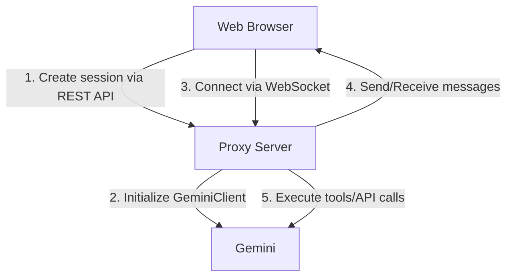

# Gemini CLI Proxy

[](https://opensource.org/licenses/MIT)
[](https://github.com/your-username/your-repo/issues)
[](https://github.com/your-username/your-repo/pulls)

A WebSocket-based proxy for the Gemini CLI that enables stateful and agentic interactions through a web interface, powered by `@google/gemini-cli-core`.

This project aims to provide flexible integration with various environments, including chats like Slack, IDEs, and CI/CD pipelines.

## Overview

This proxy mirrors the architecture of the Gemini CLI's interactive TUI mode, enabling real-time, bidirectional communication over WebSockets. This approach allows for continuous, context-aware conversations, moving beyond stateless, one-off command execution.

### Key Features

-   **Real-time Interaction**: Streaming responses over WebSockets for a fluid user experience.
-   **Stateful Session Management**: Maintains independent conversation histories for multiple sessions.
-   **Tool Execution**: Supports standard Gemini CLI tools, including file system operations, shell commands, and web searches.
-   **Slash Commands**: Implements familiar TUI commands like `/help` and `/clear` for the web.
-   **Docker Ready**: Simplified setup with Docker Compose.

## Architecture

The core components consist of a WebSocket server, a session manager, and an Express web server for handling initial setup and serving a demo client.

### Data Flow



## Getting Started

You can get the proxy up and running quickly using Docker and Docker Compose.

### Prerequisites

-   Docker and Docker Compose
-   A Gemini API Key

### Installation

1.  **Set up environment variables**

    Create a `.env` file in the project root and add your Gemini API key.

    ```.env
    GEMINI_API_KEY=your-api-key-here
    ```

2.  **Build and run the container**

    ```bash
    docker-compose up -d --build
    ```

3.  **Access the service**

    The server will be available at `http://localhost:3000`. A simple test client is served at this address.

### Development Commands

-   **View logs**:
    ```bash
    docker-compose logs -f
    ```
-   **Stop the container**:
    ```bash
    docker-compose down
    ```

## API Reference

### REST API

#### `POST /api/chat`

Initializes a new chat session.

**Response:**

```json
{
  "sessionId": "unique-session-id"
}
```

### WebSocket API

After creating a session, connect to the WebSocket endpoint.

1.  **Initialize Connection**

    Send the `sessionId` to associate the connection with a session.

    ```json
    {
      "type": "init",
      "sessionId": "unique-session-id"
    }
    ```

2.  **Send a Message**

    ```json
    {
      "type": "message",
      "content": "Your message here"
    }
    ```

3.  **Receive Responses**

    Responses from the AI are streamed as `stream_chunk` events.

    ```json
    {
      "type": "stream_chunk",
      "data": {
        "type": "content", // or "tool_code", "tool_result", etc.
        "data": "AI response text"
      }
    }
    ```

## Tech Stack

-   **Backend**: Node.js, Express
-   **Real-time Communication**: WebSocket (`ws`)
-   **Core Logic**: `@google/gemini-cli-core`
-   **Language**: TypeScript
-   **Containerization**: Docker

## Limitations

-   **Session Persistence**: Sessions are currently stored in-memory and will be lost on server restart.
-   **Scalability**: The proxy runs as a single process and is not designed for large-scale deployments without further modification.

## License

This project is licensed under the [MIT License](LICENSE).
